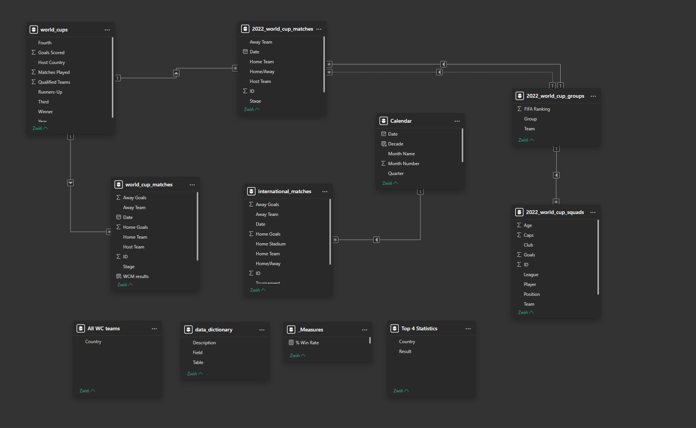

# FIFA World Cup Analysis (1930-2022) | Power BI Dashboard

## 📊 Project Overview
This interactive Power BI dashboard provides a deep dive into the history of the FIFA World Cup, spanning from the inaugural 1930 tournament to the 2022 edition in Qatar. 

The project focuses on transforming raw football statistics into actionable insights, highlighting team performances, player demographics, and historical trends.

## 🔗 Data Source
The dataset for this project was sourced from the **Maven Analytics Data Playground**.
* **Source Link:** [FIFA World Cup Dataset](https://mavenanalytics.io/data-playground/world-cup)

## 📸 Dashboard Preview
Below are the visual results of the analysis:

*Trends in goals and attendance across all tournaments (1930-2018).*

*Detailed look at player demographics and club representation for Qatar 2022.*

## 📁 Repository Files
All project components are listed below:

* `FIFA_World_Cup_Analysis.pbix` – Main Power BI report file.
* `world_cups.csv` – General tournament statistics.
* `world_cup_matches.csv` – Historical match results.
* `world_cup_players.csv` – Player and goalscorer data.
* `2022_world_cup_squads.csv` – Squad details for the 2022 edition.
* `2022_world_cup_matches.csv` – Schedule and results for Qatar.
* `.gitignore` – Configuration to exclude temporary Power BI files.
* `README.md` – Project documentation.

## 🛠️ Tech Stack & Skills
* **Tool:** Power BI Desktop
* **Data Transformation:** Power Query (M) – used for data cleaning, merging historical files, and handling data type consistency.
* **Modeling:** Star Schema relational model connecting fact tables with dimension tables.
* **Calculations:** DAX (Data Analysis Expressions) for dynamic measures and statistical indicators.

## 🧠 Data Model
The project utilizes a **Star Schema** relational model for optimal performance and clear logic.

## 💡 Key DAX Measures
Here are examples of the calculations used to power the visualizations:

-- Total Goals (Home + Away)
Total Goals = SUM('world_cup_matches'[Home Goals]) + SUM('world_cup_matches'[Away Goals])

-- Home Team Win Percentage
Home Win % = 
DIVIDE(
    CALCULATE(COUNTROWS('world_cup_matches'), 'world_cup_matches'[Home Goals] > 'world_cup_matches'[Away Goals]),
    COUNTROWS('world_cup_matches')
)
**Author:** hubwied
[**LinkedIn:**](www.linkedin.com/in/hubert-wiedeński)
