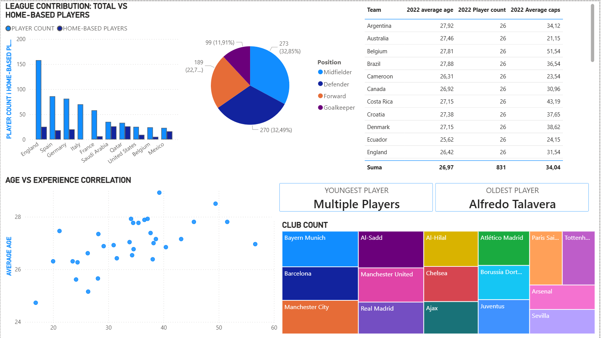

# FIFA World Cup Analysis (1930-2022) | Power BI Dashboard

## 📊 Project Overview
This interactive Power BI dashboard provides a deep dive into the history of the FIFA World Cup, spanning from the inaugural 1930 tournament to the 2022 edition in Qatar. 

The project focuses on transforming raw football statistics into actionable insights, highlighting team performances, player demographics, and historical trends.

## 🔗 Data Source
The dataset for this project was sourced from the **Maven Analytics Data Playground**.
* **Source Link:** [FIFA World Cup Dataset](https://mavenanalytics.io/data-playground/world-cup)

## 📸 Dashboard Preview
Below are the visual results of the analysis:


*Overview of World Cup history featuring a global map of tournament winners, historical KPI metrics, and a detailed breakdown of matches and goals per edition.*


*Analyzes national team success via medal counts and goal efficiency. Includes a score distribution chart identifying the most frequent match outcomes in history.*


*A detailed overview of the 2022 tournament squads, analyzing player demographics such as age, club affiliations, and league representation. It provides insights into which domestic leagues and clubs contributed the most talent to the Qatar World Cup*


*Compares goal averages across major tournaments like Euro and Copa America by decade. Analyzes the "Home Advantage" effect and tracks the cumulative growth of goals in football history.*

## 📁 Repository Files
All project components are listed below:

* `FIFA_World_Cup_Analysis.pbix` – Main Power BI report file.
* `world_cups.csv` – General tournament statistics.
* `world_cup_matches.csv` – Historical match results.
* `world_cup_players.csv` – Player and goalscorer data.
* `2022_world_cup_squads.csv` – Squad details for the 2022 edition.
* `2022_world_cup_matches.csv` – Schedule and results for Qatar.
* `.gitignore` – Configuration to exclude temporary Power BI files.
* `README.md` – Project documentation.

## 🛠️ Tech Stack & Skills
* **Tool:** Power BI Desktop
* **Data Transformation:** Power Query (M) – used for data cleaning, merging historical files, and handling data type consistency.
* **Modeling:** Star Schema relational model connecting fact tables with dimension tables.
* **Calculations:** DAX (Data Analysis Expressions) for dynamic measures and statistical indicators.

## 🧠 Data Model
The project utilizes a **Star Schema** relational model for optimal performance and clear logic.


## 💡 Key DAX Measures
Here are examples of the calculations used to power the visualizations:


-- Smart Medal Rank  
```dax
Smart Medal Rank =  
VAR Total = COUNTROWS('Top 4 Statistics')  
VAR Gold = COUNTROWS(FILTER('Top 4 Statistics', 'Top 4 Statistics'[Result] = "1st Place"))  
VAR Silver = COUNTROWS(FILTER('Top 4 Statistics', 'Top 4 Statistics'[Result] = "2nd Place"))  
VAR Bronze = COUNTROWS(FILTER('Top 4 Statistics', 'Top 4 Statistics'[Result] = "3rd Place"))  
RETURN Total + (Gold * 0.01) + (Silver * 0.0001) + (Bronze * 0.000001)
```

-- Total Goals Scored  
```dax
Total Goals Scored =   
VAR SelectedCountry = SELECTEDVALUE('All WC teams'[Country])   
VAR HomeGoals = CALCULATE(SUM('world_cup_matches'[Home Goals]), 'world_cup_matches'[Home Team] = SelectedCountry)  
VAR AwayGoals = CALCULATE(SUM('world_cup_matches'[Away Goals]), 'world_cup_matches'[Away Team] = SelectedCountry)  

RETURN   
IF(  
    ISFILTERED('All WC teams'[Country]),   
    HomeGoals + AwayGoals,   
    SUM('world_cup_matches'[Home Goals]) + SUM('world_cup_matches'[Away Goals])  
)  
```
-- Home Wins
```dax
Home Wins =   
CALCULATE(  
    COUNTROWS(international_matches),  
    international_matches[Home Goals] > international_matches[Away Goals],  
    international_matches[Home Stadium] = TRUE  
)  
```
-- Top 4 Statistics  
```dax
Top 4 Statistics =   
UNION(  
    SELECTCOLUMNS('world_cups', "Country", 'world_cups'[Winner], "Result", "1st Place"),  
    SELECTCOLUMNS('world_cups', "Country", 'world_cups'[Runners-Up], "Result", "2nd Place"),  
    SELECTCOLUMNS('world_cups', "Country", 'world_cups'[Third], "Result", "3rd Place"),  
    SELECTCOLUMNS('world_cups', "Country", 'world_cups'[Fourth], "Result", "4th Place")  
)  
```
**Author:** hubwied
[**LinkedIn:**](https://www.linkedin.com/in/hubert-wiedenski)
